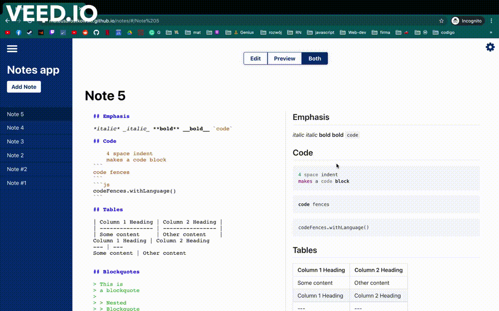

# Notes App [Live Preview](https://mateuszrostkowski.github.io/notes/)

It's a simple notes app created with react



## **Installation**

To run it in local environment follow these steps:

1. Clone/Download the code from this repository

```bash
git clone https://github.com/MateuszRostkowski/notes.git
```

2. Install dependencies

```bash
cd notes
yarn install
```

3. 🚀 **Launch Project**

```bash
yarn start
```

## **TODO**

- [x] Refactor:
  - [x] Finish Notes Provider
  - [x] Create screens folder
  - [x] Prevent rerendering of components - useMemo, useCallback, memo
  - [x] Move renders from map functions to small components
- [ ] add some toast package
- [ ] implement messaging system
- [ ] Finish designs
- [ ] Implement designs
- [ ] Write some tests
- [ ] Add some simple BE - maybe firebase or something else
